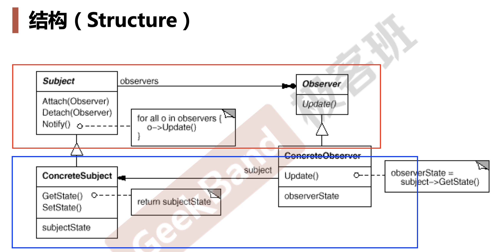

# Observer
## 1. 动机
- ### 在软件构建过程中，我们需要为某些对象建立一种“通知依赖关系”---一个对象（目标对象）的状态发生改变，所有的依赖对象（观察者对象）都将得到通知。如果这样的依赖关系过于紧密，将使软件不能很好地抵御变化。
- ### 使用面向对象技术，可以将这种依赖关系弱化，并形成一种稳定的依赖关系。从而实现软件体系结构的松耦合。

---

## 2. 违背的设计原则
- ### 依赖倒置原则（DIP）
  - #### 高层模块(稳定)不应该依赖于低层模块(变化)，二者都应该依赖于抽象(稳定).
  - #### 抽象(稳定)不应该依赖于实现细节(变化) ，实现细节应该依赖于抽象(稳定)。
  > #### 设计模式中，```依赖```一般指```编译时依赖```

---
## 3. 多继承
- ### 多继承一般使用法则： 单继承一个父类，其他都是接口 （例如：[注释](./code/MainForm.cpp)）

---
## 4. 模式定义
- ### 定义对象间的```一种一对多```（变化）的依赖关系，以便当一个对象（Subject）的状态发生变化时，所有依赖于它的对象都得到通知并自动更新。

---
## 5. 结构

---
## 6. 要点总结
- ### 使用面向对象的抽象，Observer模式使得我们可以独立地改变目标与观察者，从而使二者之间的依赖关系达到松耦合
- ### 目标发送通知时，```无需指定观察者，通知（可以携带通知信息作为参数）会自动传播```
- ### 观察者自己决定是否需要订阅通知，目标对象对此一无所知。
- ### Observer模式是基于事件的UI框架中非常常用的设计模式，也是MVC模式的一个重要组成部分。