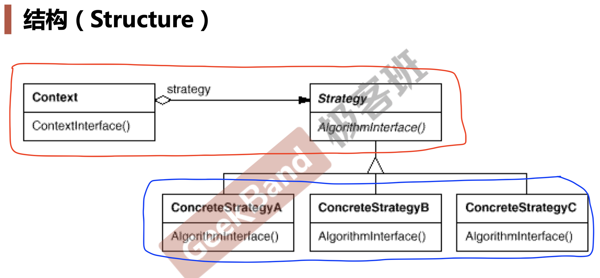

# Strategy 策略模式
## 1.  与 ```Template Method模式``` 有异曲同工之妙

---
## 2. 动机（Motivation）
- ###  在软件构建过程中，某些对象用到的算法可能多种多样，经常改变，如果将这些算法都编码到对象中，将会使对象变得异常复杂；而且有时候支持不使用的算法也是一个性能负担（例如：[if...else if...](./code/strategy1.cpp),在某些国家，只执行某一条件，其他代码段都不执行，这样就会对性能有影响）。
- ### 如何在运行时，根据需要透明地更改对象的算法？将算法与对象本身解耦，从而避免上述问题？
---
> ### ```应该有这种思维层次：不要静态的看一个软件结构设计，而是要动态的看。也是就是，作为程序员，要有一个时间轴的概念。考虑到问题未来的变化的情况。```
---
## 3. 开闭原则（对扩展开放，对更改封闭）
- ### [更改的部分](./code/strategy1.cpp)违背了该原则。
- ### 该原则是：类模块应该尽量以扩展的方式，支持未来的变化，而不是找到源代码，直接改源代码。
---
## 4. 模式定义
-   ### 定义一系列算法，把它们一个个封装起来，并且使它们可```互相替换（变化）```。该模式使得算法可```独立于```使用它的客户程序（稳定）而变化```（扩展，子类化）```。
---
## 5. 结构（Struct）
-   ### 红色代表稳定的部分
-   ### 绿色代表变化的部分（增加法国，日本税法）


---
## 6. 要点总结
- ### Strategy及其子类为组件提供了一系列可重用的算法，从而可以使得类型在```运行时```，方便地根据需要在各个算法之间进行切换
- ### Strategy模式提供了用条件判断语句以外的另一种选择，消除条件判断语句，就是在解耦合。含有许多条件判断语句的代码通常都需要Strategy模式。
  > #### 在代码中一旦出现 ```if..else..```或者```switch ..case..``` 的话，一般是需要使用Strategy模式的特征。如果 ```if..else..```或者```switch ..case...```判断内容不会再变（增加），也不需要使用 Strategy 模式。
- ### 如果 Strategy对象没有实例变量，那么各个上下文可以共享同一个Strategy对象，从而节省对象开销。