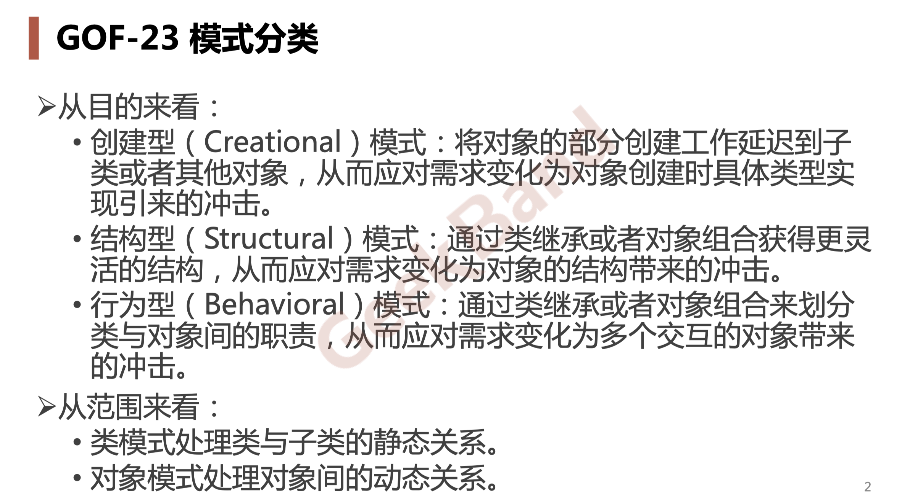
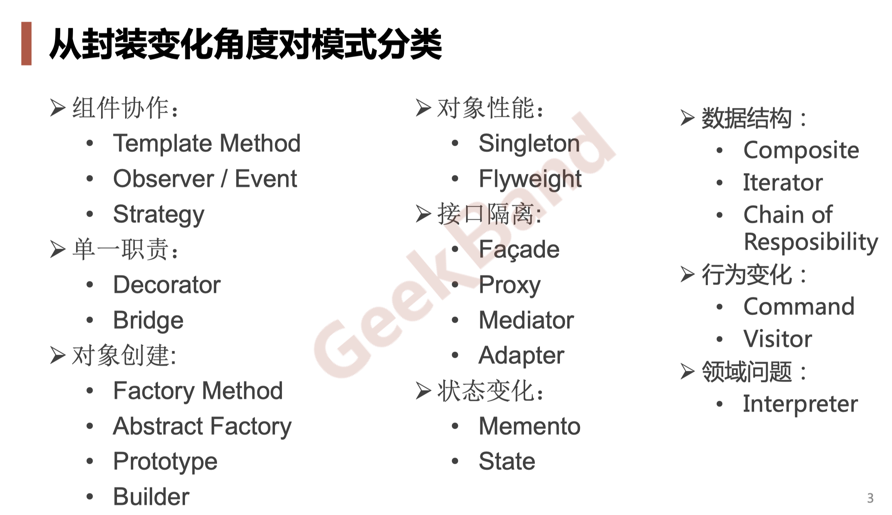
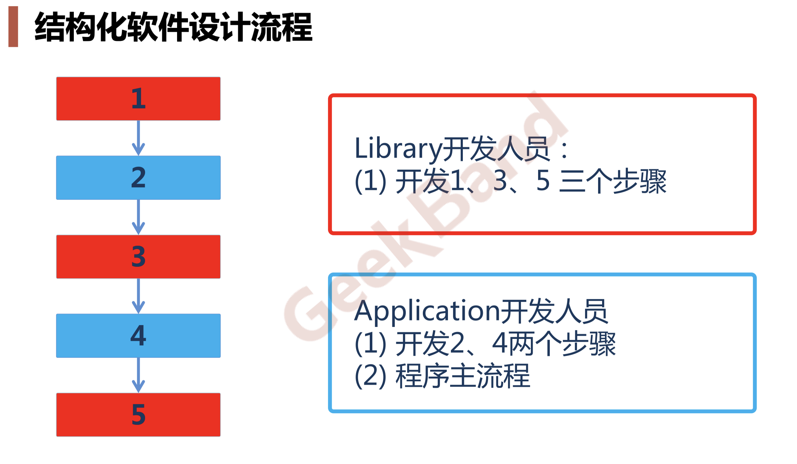
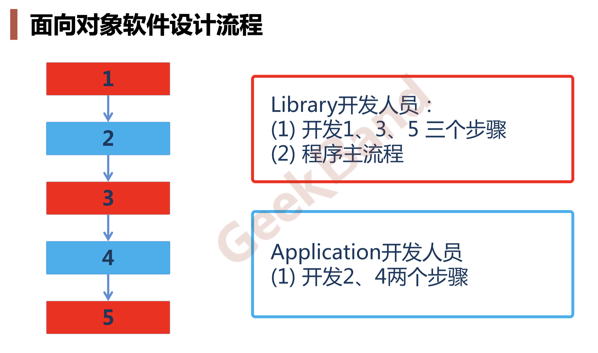
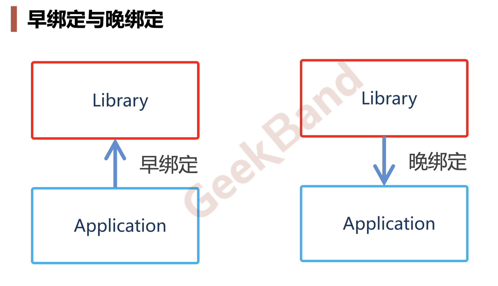
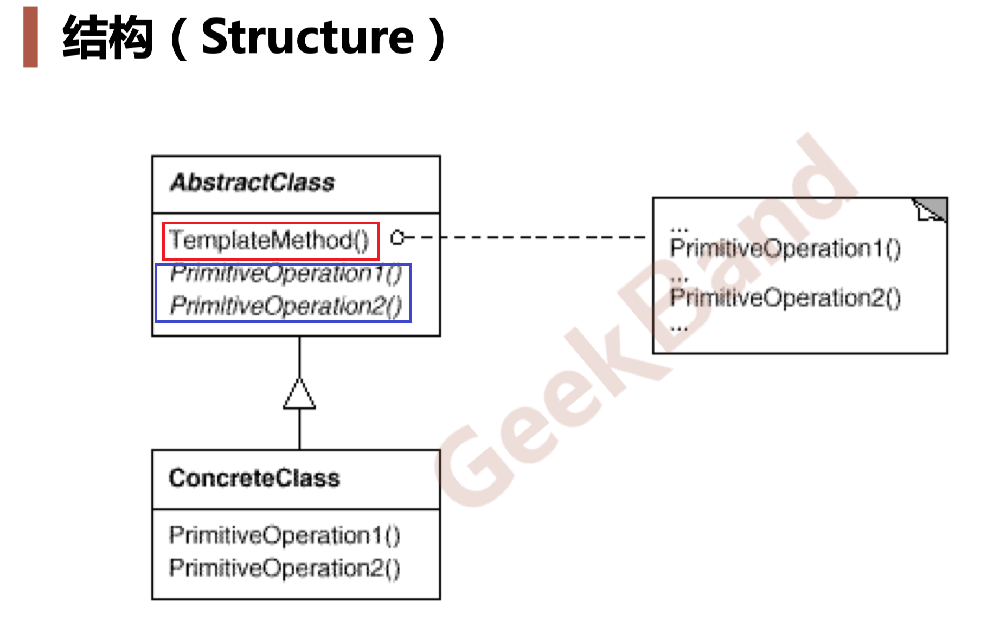

# Template Method
## 1. 模式分类
  - ### 类模式更偏重于继承方案
  - ### 对象模式更偏重于组合方案，（一个类里面包含另一个类的对象或者指针）

  
---
## 2. 从封装变化角度对模式分类
  - ### 在教学和实践中，领悟的另一种分类方法
  

---
## 3. 学习设计模式时，非常重要的一个方法（```重构获得模式 Refactoring to Patterns```）
  - ### 面向对象设计模式是```好的面向对象设计```，所谓好的面向对象设计是指那些满足```"应对变化，提高复用"```的设计。
  - ### 现代软件设计的特征是```“需求的频繁变化”```。设计模式的要点是 “```寻找变化点```，然后```在变化点处应用设计模式```，从而来更好地应对 需求的变化” 。```“什么时候、什么地点应用设计模式”比“理解设 计模式结构本身”更为重要```
  - ### 设计模式的应用不宜先入为主，一上来就使用设计模式是对设计模式的最大误用。没有一步到位的设计模式。```敏捷软件开发实践提倡的“Refactoring to Patterns”是目前普遍公认的最好的使用设计模式的方法。```
---
## 4. 重构关键技法
  - ### 静态--->动态
  - ### 早绑定--->晚绑定
  - ### 继承--->组合
  - ### 编译时依赖--->运行时依赖
  - ### 紧耦合--->松耦合

---
## 5. "组件协作"模式：
  - ### 现代软件专业分工之后的第一个结果是```"框架与应用程序的划分"```。"组件协作"通过```晚期绑定```，来实现框架与应用程序之间的松耦合，是两者之间协作时常用的模式。
  - ### 典型模式
    - #### Tempalte Method
    - #### Strategy
    - #### Observer/Event
  
---

## 6. Tempalte Method
  - ### 动机(Motivation)
    - #### 在软件构建过程中，对于某一项任务，它常常有```稳定```的整体操作结构，但各个子步骤却有很多```改变```的需求，或者由于固有的原因（比如框架与应用之间的关系）而无法和任务的整体结构同时实现。
    - #### 如何在确定```稳定操作```结构的前提下，来灵活应对各个子步骤的```变化```或者```晚期实现需求```？

---
## 7. 结构化软件设计流程
  - ### Application 调用 Library
 

---
## 8. 面向对象软件设计流程
  - ### Library 调用 Application


---
## 9. 早绑定与晚绑定
  - ### Libray 实现的早，Application 实现的晚。
  - ### Application 调用 Library ，属于早绑定（一个晚的东西调用一个早的东西）
  - ### Library 调用 Application， 属于晚绑定（一个早的东西调用一个晚的东西）


---
## 10. 模式定义
  - ### 定义一个操作中的算法的```骨架（稳定）```，而将一些步骤```延迟（变化）```到子类中。**Template Method 设计模式** 使得子类可以```不改变（复用）```一个算法的结构即可重定义```（override 重写）```该算法的某些特定步骤。
  > #### 1.```骨架```--例如：[成员函数Run](./code/template2_lib.cpp)<br>2. ```延迟（变化）到子类```：在面向对象中，一般指定义一个虚函数，让子类实现（override）虚函数
---
 ## 11. **Template Method 设计模式 使用的前提是**: ```骨架必须是稳定的```
  - ### 所有设计模式的一个假设条件是：```必须有一个稳定点```。
  - ### 当所有点都是稳定点时，设计模式也没有任何意义。
  - ### 设计模式最大的作用：在稳定和变化之间，寻找隔离点，然后分离它们，从而管理变化。（把变换关在一个笼子里面）
  - ### 稳定和变化是相对的。例如：如果[成员函数Run](./code/template2_lib.cpp)十年才变一次，而其他部分变化周期比它短，那么[成员函数Run](./code/template2_lib.cpp)相对而言是稳定的。
---
## 12. 结构（Struct）
  - ### 红色部分是稳定的部分
  - ### 蓝色部分是变化的部分


---
## 13. 日常习惯
  - ### ```看类图时，用笔画一画，哪些是稳定，哪些是变化的。```
---

## 14. 要点总结
  - ### Template Method模式是一种```非常基础性```的设计模式，在面向对象系统中有着大量的应用。它用最简洁的机制（```虚函数额多态性```），为很多应用程序框架提供了灵活的```扩展点```，是代码复用方面的基本实现结构。
    > #### 什么叫扩展：继承+虚函数（多态）
  - ### 除了可以灵活应对子步骤的变化外，“不要调用我，让我来调用你”的```反向控制结构```是 Template Method 的典型应用。
    > #### 虚函数是面向对象里面最核心的晚绑定机制。但是任何一个编程语言中的晚绑定机制，不止有虚函数。比如函数指针（但在某种程度没有虚函数更好的抽象性）。 
  - ### 在具体实现方面，被 Template Method 调用的虚方法可以具有实现，也可以没有任何实现（抽象方法，纯虚方法），但一般推荐将它们设置为```protected``` 方法。
  